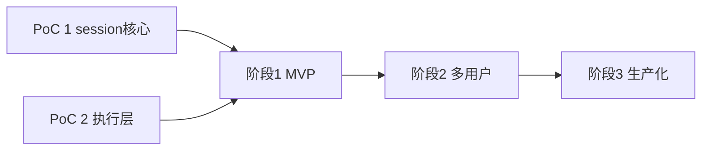

# PiClaw Serverless 云端版 — 实现计划

状态：草案（2026-07-29）· [分阶段执行路线图（PHASES.md）](PHASES.md)
设计依据：[serverless-design.md](serverless-design.md)

## 代码组织

在本仓库新建 `cloud/` bun workspace，与现运行时并存（现运行时继续作为自托管产品维护）：

```
cloud/
├── brain/          # 无状态服务：API + turn 执行器 + SSE
│   └── src/
│       ├── api/            # 路由、OAuth、配额
│       ├── turn/           # turn 执行器、水化、工具循环
│       ├── events/         # Redis pub/sub 发布与 SSE 订阅桥
│       ├── sandbox/        # E2B SDK 封装（CubeSandbox endpoint）
│       └── store/          # PG 访问层（session-cursors 等自 runtime/src/db 移植）
├── scheduler/      # scheduler worker：next_run 轮询 + inflight 恢复扫描 + 归档扫描
├── shared/         # SSE 事件词表类型、schema 定义、领域类型（自 runtime/src/types 提炼）
├── migrations/     # PG schema（自 docs/storage.md 的 SQLite schema 移植）
└── poc/            # 阶段 0 的两个 PoC（验收后并入 brain）
```

Web UI 不复制：`runtime/web` 增加 build target（`cloud`），差异点收敛到 API base、登录页、workspace 后端语义开关。SSE 事件词表以 `cloud/shared` 中的类型定义为唯一规范，brain 与 web 共同引用。

## 阶段划分

### 阶段 0 — 风险验证（PoC，短平快，不追求代码质量）

目标：把设计文档 §14 的前三个风险变成实测数据，任何一项不达标先回炉设计。

- **PoC 1 session 核心**（`cloud/poc/turn-loop`）
  - 最小 PG schema（sessions / messages / session_cursors）+ Redis + 两副本 Bun 服务
  - 跑通：advisory lock → 水化 → LLM 流式 → Redis pub/sub → SSE → 落库 → follow-up 排队
  - 故障注入：流式中途 kill 执行副本，验证锁释放 + inflight 恢复接管
  - 计量：单 turn 的 PG 往返次数与耗时；`cache_read_tokens` 占比 vs 自托管基线（从现有 `token_usage` 表导出）
  - 验收：恢复无消息丢失/重复；stable-prefix 水化下 cache 命中率降幅 < 15%
- **PoC 2 执行层**（`cloud/poc/sandbox`）
  - E2B SDK 连 CubeSandbox：exec、files 读写、PTY create/attach/重连
  - pause → resume 后验证：文件系统保持、后台进程存活（确认 pause 是否含内存态）、PTY 会话行为
  - artifacts 归档 COS → 新 sandbox 恢复的往返
  - 验收：PTY 兼容可用；resume 延迟 p95 < 1s；归档往返无损
- **依赖**：CubeSandbox 集群 endpoint + 凭证；一个 LLM provider key；本地 docker PG/Redis

### 阶段 1 — MVP：单用户端到端

目标：一个用户、多个 session、完整 chat + 代码执行 + terminal 体验，功能对齐自托管版核心路径。

1. `migrations/`：PG schema 全量移植（含 RLS 策略，先启用不强依赖）
2. `cloud/store`：移植 `runtime/src/db/chat-cursors.ts`（状态机单 SQL 语义原样翻译）、messages、tasks、token-usage 查询层
3. `cloud/brain/turn`：turn 执行器——水化、LLM 流式、工具循环、steering 注入（Redis control 频道）、compaction 语义接入
4. `cloud/brain/events`：按 `shared` 事件词表发布；SSE 端点（`/sessions/:id/stream`，兼容现 `/sse/stream?chat_jid=` 寻址）
5. `cloud/brain/sandbox`：工具路由——bash/edit/文件类工具进 sandbox，纯 API 工具留 brain；sandbox 惰性创建与绑定
6. workspace API 一族改为代理 sandbox 文件接口（保持客户端分块上传协议）；media 一族改 COS
7. `runtime/web` cloud build target：API base、登录占位（本阶段单用户免登录）、terminal 指向 sandbox PTY
8. 验收：用现有 Web UI 完成「创建 session → 对话 → 跑代码 → 开 terminal → 断线重连补齐 → follow-up 排队/转向」全流程

### 阶段 2 — 多用户与生命周期

目标：注册用户即可用，隔离与资源回收生效。

1. OAuth/SSO 登录 + 用户体系（`users` 表、会话 cookie）
2. RLS 强制启用 + 越权测试用例；Redis 频道订阅校验
3. `cloud/scheduler`：next_run 轮询（移植 `computeNextRun`）、inflight 恢复扫描（移植 `recoverInflightRuns` 判定逻辑）、空闲归档扫描（pause → 回收 → COS 迁移）
4. 配额：同时活跃 sandbox 数、每日 token 上限（读 `token_usage` 聚合）
5. session 管理 UI 映射：现分支/多会话 API（`getChatBranches` 等）映射为 session 目录 CRUD
6. Dream/AutoDream 作为普通计划任务接入
7. 验收：两个用户并行使用互不可见；空闲 session 自动 pause/归档并可无损回访；配额超限有明确 UX

### 阶段 3 — 生产化

目标：可对外运营。

1. 计费管道：`token_usage` + sandbox 活跃时长 → 账单聚合
2. 可观测：结构化日志、turn 级 trace、sandbox 池容量与 pause/resume 延迟指标、KV-cache 命中率看板
3. 部署：brain 多副本 + 长 turn drain（缩容前停接新 turn）、scheduler 单实例抢锁互备、PG/Redis 高可用
4. 压测：并发 turn、并发 SSE、sandbox 创建风暴；按 Devin 教训重点测快照/恢复稳定性
5. 安全审计：egress 白名单策略、credential vault 注入路径、RLS 覆盖复查
6. 验收：`make ci` 式回归门 + 压测报告 + 安全清单通过

## 阶段依赖与并行度



- PoC 1 与 PoC 2 完全独立，可并行
- 阶段 1 内部：store/migrations（任务 1-2）与 sandbox 封装（任务 5 的 SDK 部分）可并行先行；turn 执行器依赖两者
- 阶段 2 的 scheduler 与 OAuth 互相独立，可并行

## 回退门（gate）

- PoC 1 cache 命中率降幅 ≥ 15% 且无法通过稳定前缀策略修复 → 重新评估「per-session 常驻推理上下文」的混合方案再进阶段 1
- PoC 2 PTY 兼容不可用 → terminal 降级方案（brain 内 WebSocket 桥 + sandbox exec 流式）纳入阶段 1 范围
- PoC 2 pause 不含内存态 → 设计文档 §8 的「后台进程存活」预期降级为「文件系统保持」，产品文案同步调整

## 与现仓库的关系

- 现自托管运行时不受影响，继续按现流程发布
- `cloud/` 参与 repo 的 typecheck/test 门（`bun run typecheck`、`make ci-fast` 扩展）
- 从 `runtime/src` 移植代码时**复制而非 import**（两侧演化节奏不同），但 `shared` 事件词表类型由 web 与 brain 共同引用，作为唯一强共享点
