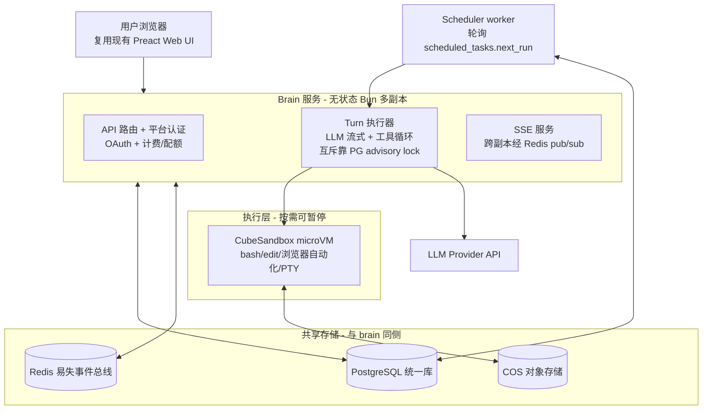
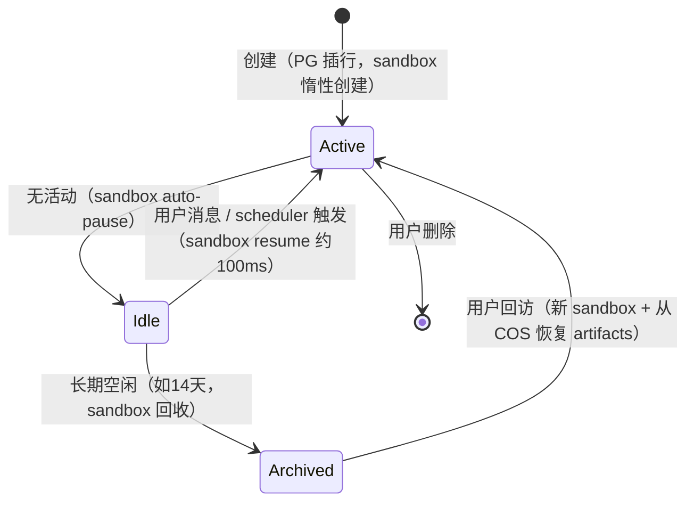
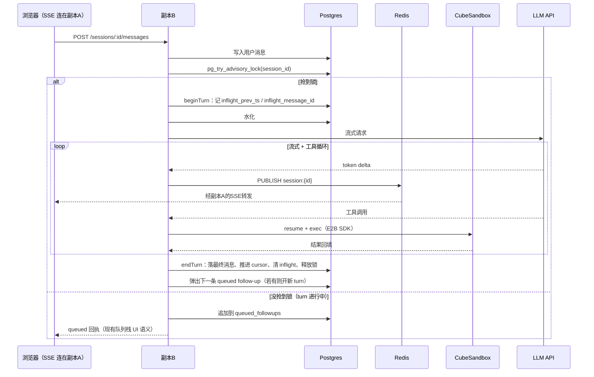

# PiClaw Serverless 云端版 — 架构设计

状态：草案（2026-07-29）
前置讨论：[docs/azure/azure-functions-feasibility-study-2026-04-17.md](../azure/azure-functions-feasibility-study-2026-04-17.md)、[docs/architecture.md](../architecture.md)、[docs/runtime-flows.md](../runtime-flows.md)、[docs/storage.md](../storage.md)
实施拆解：[implementation-plan.md](implementation-plan.md)

## 1. 概述与结论

本设计把 PiClaw 从「单用户、单进程、有状态的自托管工作区运行时」重构为「多用户、无状态、按需执行的云端服务」。核心判断：

- **可行**。2026-04 的 Azure Functions 研究判定纯 serverless 不可行，其前提是保持现有产品形态（长驻进程、本地 SQLite、本机 shell）不变。本设计放弃该前提：session 按需水化、代码执行下沉 sandbox、cron 独立为 scheduler worker——三个改变逐条化解了原研究的全部硬阻塞。
- **性质是数据面重写，不是部署迁移**。复用 PiClaw 的领域语义（turn 状态机、follow-up 队列、工具集、staged tool loading）和大部分 Preact Web UI；替换运行时宿主（AgentPool warm session、本地 SQLite、supervisor、文件 IPC 全部作废）。
- **架构形状与主流云端 agent 一致**：Devin 的 Brain/Devbox 分离、Manus 的 agent loop 外置 + per-task microVM、Codex 的 container-per-task，共识都是「无状态/可水化的 agent 循环 + 按需隔离执行环境」。

### 产品形态

- 一个用户可创建任意多个 **session**，每个 session 等价于现在的一个 chat：独立时间线、独立 agent 上下文、独立执行环境
- session 之间、用户之间完全隔离（见 §10）
- 代码执行、文件操作、终端、浏览器自动化全部发生在该 session 专属的可暂停 microVM 中
- 定时任务是平台定时器语义：到点触发一个普通 turn

## 2. 技术栈（五组件，单云侧部署）

| 组件             | 职责                                                                                      | 选型理由                                                                                                      |
| -------------- | --------------------------------------------------------------------------------------- | --------------------------------------------------------------------------------------------------------- |
| Brain 服务       | 无状态 Bun/TypeScript 多副本：API/认证、turn 执行器、SSE                                              | 与现运行时同语言，`queue.ts`/`task-scheduler.ts`/turn 状态机可改造复用                                                     |
| PostgreSQL     | 唯一数据库：messages/cursors/followups/tasks/token_usage/用户/计费；advisory lock 做 per-session 互斥 | 统一运营与计费查询；schema 从现 SQLite 近乎原样移植                                                                         |
| Redis          | 易失事件总线：token delta / 状态心跳的 pub/sub；presence/限流                                          | 逐 token 流式的频率与 payload 不适合 LISTEN/NOTIFY（8KB 上限、全局 notify 队列锁、LISTEN 与连接池不兼容）                             |
| CubeSandbox 集群 | 每 session 一个可暂停 KVM microVM；bash/edit/浏览器/PTY                                           | E2B SDK 兼容；<60ms 冷启动、约 100ms resume、snapshot/clone/rollback、eBPF 隔离、L7 egress 白名单、credential vault；开源可自托管 |
| COS 对象存储       | 媒体 blob、artifacts 归档、sandbox 回收迁移                                                       | S3 兼容；blob 不进 PG                                                                                          |

不引入的东西及原因：

- **Cloudflare（Workers/DO/R2）**：数据统一 PG 后，DO 只剩串行/SSE/定时三个职责，均由 PG advisory lock、Redis pub/sub、scheduler worker 以更低复杂度承担；避免跨云 DB 往返与第三朵云的运维面
- **每租户常驻容器**（形态 B）：成本随租户线性增长，且与「一个用户开一堆 session」的产品定位冲突
- **自建 sandbox 快照层**：Devin 公开教训——大规模可靠快照/恢复是他们最难的基础设施问题；直接用 CubeSandbox 平台托管的 auto-pause/resume

## 3. 总体架构

### Brain 服务职责边界

Brain 是现 PiClaw 运行时的「计算部分」：`WebChannel` 的 HTTP/SSE/认证 → API 层；`Router` + `AgentQueue` + `AgentPool` 的执行编排 → turn 执行器。唯一被删除的是 warm `AgentSession`（常驻内存会话），换成按需水化。

- **在 brain 内跑**：agent 循环（LLM 调用、工具编排）、纯 API 型工具（web search、MCP over HTTP）、认证/计费/配额、SSE
- **不在 brain 内跑**：一切触碰文件系统或进程的工具（bash、edit、浏览器自动化、image_process、PTY）——全部经 E2B SDK RPC 到该 session 的 CubeSandbox。这个边界即安全边界：LLM 生成的代码永远不在 brain 进程空间执行

「无状态」的准确含义：副本内存中没有丢失即造成损失的数据。turn 中途副本被杀，advisory lock 随连接断开自动释放，`chat_cursors` 的 inflight 标记仍在 PG，任意副本按恢复协议接管（§6.3）。

## 4. 数据模型

### 4.1 从 SQLite 移植

现 schema（见 [docs/storage.md](../storage.md)）无 SQLite 特有方言，核心表近乎原样移植，统一追加 `user_id` / `session_id` 列：

- `sessions`（新，替代 `chats`）：id、user_id、title、sandbox_id、状态、created_at
- `messages`：加 `session_id`；`content_blocks`/`link_previews` 改 `jsonb`
- `session_cursors`（对应 `chat_cursors`）：turn 状态机字段原样保留——`cursor_ts`、`inflight_prev_ts`、`inflight_message_id`、`inflight_started_at`、`failed_*`、`queued_followups_json`
- `scheduled_tasks` / `task_run_logs`：原样，加 `session_id`
- `token_usage`：原样，加 `user_id`/`session_id`（计费直接按此聚合）
- `users` / `billing_*` / `quotas`（新，控制面）

不迁移的表：`media`（blob 改 COS，PG 只存元数据）、`workspace_files`/`workspace_fts`（workspace 在 sandbox 内，搜索在 sandbox 内做）、`webauthn_*`/`web_sessions`（实例级认证不迁移）、`remote_*`（跨实例互联不适用）、`keychain_entries`（改 credential vault，见 §10.4）。

### 4.2 行级安全（RLS）

API 层强制按登录身份过滤是第一道防线；PG RLS 是兜底：每个业务表启用 RLS 策略 `user_id = current_setting('app.user_id')`，brain 在拿连接后先 `SET app.user_id`。应用层漏写 `WHERE` 时，数据库层面拦截越权行。

## 5. Session 生命周期

- **创建**是纯元数据操作（PG 插一行）；sandbox 在第一次需要执行工具时才创建（Manus 同款惰性策略）
- **Idle**：sandbox pause 后只占磁盘快照，不占算力内存；session 本身无成本（brain 无状态）
- **Archived**：回收 microVM，仅把 artifacts、上传件、显式标记的重要文件迁移 COS；中间产物（临时文件、装过的包）放弃——与 Manus 的 7/21 天回收语义一致
- 配额按**同时活跃 sandbox 数**计，不限 session 总数

### 水化协议

turn 开始时从 PG 组装 agent 上下文：读取 session 元数据 + 最近消息窗口（含 compaction 摘要）+ cursor + follow-up 队列。水化产物即 LLM prompt 的会话部分；不重放全部历史（上下文管理沿用现有 compaction 语义，摘要持久化在 messages 流中）。

## 6. Turn 执行协议

### 6.1 正常路径

### 6.2 follow-up 与 steering

现架构的双层队列语义原样保留，且简化：持久层就是 `session_cursors.queued_followups_json`（现有字段），内存 placeholder store 不再需要（brain 无状态，一切以 PG 为准）。取消（×）、转向（→ 注入进行中 turn 作为 steering）、上移/下移重排——API 语义照搬现有 `/agent/queue-reorder` 一族。steering 的注入通道：执行副本订阅 Redis 的 `session:{id}:control` 频道，收到 steering 事件后注入当前 LLM 循环（对应现有 mid-turn steering）。

### 6.3 崩溃恢复

现架构的恢复语义（[docs/runtime-flows.md](../runtime-flows.md) turn state machine）移植到多副本：

- 状态转移仍是单条 SQL（`beginTurn`/`endTurn`/`endTurnWithError`/`rollbackInflight`），PG 事务保证 crash-safe
- advisory lock 随连接断开自动释放——副本被杀不会留死锁
- **恢复扫描**由 scheduler worker 兼任：周期查找 `inflight_message_id` 非空但锁已空闲的 session；已有终态回复则清标记；inflight 超过 30 分钟（沿用 `MAX_INFLIGHT_AGE_MS`）清而不重试；否则回滚 cursor、删非终态 bot 消息、重新入队——逐条对应现有 `recoverInflightRuns` 逻辑
- 恢复完成的消息沿用 `recovery_marker` 内容块，Web UI 的 recovered/timeout chip 无需改动
- 部署伸缩需对长 turn 排空（drain）：缩容前停接新 turn，等在跑的 turn 完成或到超时上限

## 7. 流式事件分层

| 层       | 载体                           | 内容                                        | 丢失后果                                        |
| ------- | ---------------------------- | ----------------------------------------- | ------------------------------------------- |
| 易失流     | Redis pub/sub `session:{id}` | token delta、thinking delta、tool status 心跳 | 进行中的流式画面中断，SSE 重连后从 PG 补齐（现有 Web UI 断线恢复语义） |
| 持久truth | PostgreSQL                   | 最终消息、cursor、队列、任务、用量                      | 不允许丢                                        |

Redis 不承载 record 数据。SSE 连接由任意副本持有，按用户订阅其活跃 session 频道；执行副本与 SSE 副本解耦，负载均衡无需 session 粘性。

## 8. Sandbox（CubeSandbox）

- **绑定**：一个 session 一个 microVM，id 记录在 `sessions.sandbox_id`；模板镜像预装 PiClaw 工具链（git、bun、python、headless chromium 等），从 OCI 镜像构建（`cubemastercli tpl create-from-image`）
- **生命周期**：惰性创建 → 工具调用时 resume → 空闲 auto-pause →长期空闲回收（§5）
- **接口**：brain 经 E2B SDK 调用（CubeSandbox 的 CubeAPI 是 E2B 兼容网关，换 API URL 接入）；未来换 E2B Cloud/其他兼容实现只是换 endpoint
- **terminal**：Web UI 的 xterm.js 前端保留，后端从本地 PTY 换成 sandbox PTY attach（E2B PTY API：实时双向、断线重连、会话保持）
- **网络**：默认拒私网段；egress 走 L7 域名白名单，按用户/套餐配置
- **密钥**：CubeSandbox credential vault——密钥在 egress 代理层以 header 重写注入，不进 sandbox 文件系统、不进模型上下文；替代现有 keychain 的「注入环境变量」语义并更强
- **回收迁移**：artifacts / 上传件 / 显式标记文件 → COS → 新 sandbox 恢复；PoC 需验证 E2B 兼容层的 PTY 覆盖度与 pause 是否含内存状态

## 9. 定时任务与后台 turn

- scheduler worker（独立小进程，可单副本 + 抢锁互备）轮询 `scheduled_tasks.next_run`，到点把 turn 任务提交给 brain（走与用户消息相同的入口与互斥）——`task-scheduler.ts` 语义几乎原样复用
- 同时兼任 §6.3 的 inflight 恢复扫描与 §5 的空闲归档扫描
- Dream/AutoDream 降级为普通后台 turn：按 session 的计划任务触发，走同一 turn 管道；不再有独立 dream lane 进程语义
- 第一版不做跨 session 的用户级共享记忆：现「所有 chat 共享 workspace/notes/Dream 记忆」语义不迁移，将来作为显式功能（如用户级 notes 存储挂载）另行设计

## 10. 隔离与安全模型

| 层     | 机制                                                    | 强度                           |
| ----- | ----------------------------------------------------- | ---------------------------- |
| 执行    | per-session KVM microVM（独立内核）+ eBPF 跨箱隔离 + egress 白名单 | 硬件级；同一用户的 session 之间也是 VM 边界 |
| 数据    | API 按身份过滤 + PG RLS 兜底（§4.2）                           | 逻辑隔离 + 库级纵深防御                |
| 流式    | Redis 频道按 session 划分，订阅前校验归属                          | 逻辑隔离                         |
| 密钥    | credential vault header 注入，不落 sandbox、不进模型上下文         | 堵死「LLM 念出密钥」路径               |
| Brain | 不执行用户代码，多租户风险等价于普通 SaaS API 服务                        | 常规                           |

认证：OAuth/SSO 在 brain API 层完成（平台账号体系）；现有 TOTP/passkey 是实例级自托管认证，不迁移。

## 11. KV-cache 稳定性策略

warm session 的最大隐性收益是 LLM provider 的 prompt cache 命中；按需水化必须显式保住它（Manus 公开将此列为上下文工程核心）：

1. **稳定前缀**：system prompt、工具定义、session 元数据严格字节稳定（无时间戳、无随机序）；变化内容只追加在尾部
2. **追加式上下文**：水化结果确定性重建——同一 session 两次水化产出字节相同的前缀；消息窗口只在尾部增长，compaction 摘要作为消息插入而非改写前缀
3. **工具集不热换**：staged tool loading 改为「全量定义 + 按阶段掩码/引导」，避免工具定义变动打断缓存前缀
4. **计量验证**：`token_usage` 已有 `cache_read_tokens` 字段，上线前后对比 cache 命中率；现有自托管数据可先算出基线

## 12. 成本模型（结构）

- **算力**：brain 副本按并发 turn 伸缩（每 turn 主要是等 LLM/等 sandbox 的 IO，单副本可持有大量并发）；sandbox 只在活跃时计费（paused 仅磁盘快照）
- **存储**：PG（消息/元数据，量小）+ COS（媒体/归档，便宜）+ sandbox 快照（每 session 一份，随回收清理）
- **LLM token**：最大变量。KV-cache 命中率是关键杠杆（§11）；上线前用 PoC 实测「水化 + 稳定前缀」下的 cache_read 占比与现有自托管基线的差值
- 对比形态 B（每租户常驻容器 2C4G）：本方案空闲 session 成本趋近于零，重度用户按活跃时间计费，成本曲线与收入曲线同形

## 13. 复用与重写清单

复用（低改造成本）：

- **Web UI 大部分（复用率约 85%+，SSE 部分接近 100%）**：timeline、compose、steering/队列栈、panes、编辑器、viewers、recovered/timeout chip、terminal 前端均不变
  - `api.ts` 的 `SSEClient` 是标准 EventSource + 事件名分发，内置指数退避重连、心跳、70s 陈旧检测、重连后全量补齐（`refreshQueueState`）——正是「Redis 只丢流式画面、重连从 PG 补齐」协议的客户端半边，现成可用
  - **SSE 事件词表即新后端的输出规范**：brain 按同名事件（`agent_response`/`agent_status`/`agent_draft_delta`/`agent_thought_delta`/`agent_followup_*`/`agent_steer_queued`/`model_changed` 等）与同构 payload 发出，UI 零改动
  - 多 session 寻址已存在：几乎所有 API 均带 `chatJid` 参数，且已有分支/多会话 API 面（`getChatBranches`/`forkChatBranch`/`createRootChatSession`），`chat_jid → session_id` 仅是命名映射
  - 需重新背书的服务端语义（客户端 API 形状保持）：workspace 一族改为 brain 代理 sandbox 文件 API（分块上传协议原样保留）、media 一族改 COS、登录页换平台 OAuth；`extension_ui_*` 通道保留但第一版不接 add-on
- **领域语义**：turn 状态机、双层 follow-up 队列、side prompt/`/btw`、compaction 语义、工具集定义
- **可改造复用的代码**（按核对后的实际成本标注）：
  - `db/chat-cursors.ts`（约 1000 行）——复用价值最高：全部状态转移为单条 SQL（含 preflight/inflight/failed 与 compaction backoff 状态），翻译到 PG 方言即可，crash-safe 设计直接成立
  - `queue/retry-policy.ts`——原样复用；`queue.ts` 本体的内存 lane 串行被 PG advisory lock 取代，不迁移
  - `task-scheduler.ts`——轮询循环与 `computeNextRun` 形状复用，但实现耦合 AgentPool/dream/tracked-bash，属参考移植（中等成本）
  - `agent-control/`（斜杠命令解析）与 db 访问层查询逻辑——方言小改

重写（新代码，均 Bun/TS）：

- turn 执行器（AgentPool 减去 warm session 与本地工具工厂）
- 存储访问层（PG + Redis + COS 客户端）
- 工具执行层（本地 spawn → E2B SDK RPC；terminal → sandbox PTY attach）
- 控制面（用户、计费、配额、session 目录）

作废：supervisor/entrypoint、文件 IPC、WhatsApp/Baileys 通道（未来走 WhatsApp Cloud API webhook）、实例级 TOTP/passkey、workspace FTS（搜索下沉 sandbox）。

## 14. 风险与验证计划

| 风险                                          | 缓解                                            | 验证                              |
| ------------------------------------------- | --------------------------------------------- | ------------------------------- |
| prompt cache 命中率下降 → token 成本上升             | §11 全套策略                                      | PoC 1 实测 cache_read 占比 vs 自托管基线 |
| CubeSandbox E2B 兼容覆盖度（PTY、pause 含内存与否、保留策略） | 接口层隔离，可换兼容实现                                  | PoC 2 逐项验证                      |
| 多副本下长 turn 的排空与接管                           | advisory lock 自动释放 + inflight 恢复扫描 + 部署 drain | PoC 1 杀副本注入故障                   |
| 自运维 sandbox 集群可靠性                           | 用平台托管 pause/resume，不自建快照层；容量监控                | 压测                              |
| VNC/完整桌面自动化                                 | headless 浏览器优先；完整桌面取决于模板镜像能力                  | 二优先级验证                          |

### PoC 计划

1. **PoC 1（session 核心）**：无状态 Bun 服务 + PG + Redis，跑通「advisory lock → 水化 → LLM 流式 → Redis 扇出 SSE → 落库 → follow-up 排队」；验证多副本互斥、杀副本恢复、cache_read 占比
2. **PoC 2（执行层）**：bash/edit 经 E2B SDK 打到 CubeSandbox；验证 PTY 兼容、pause/resume 状态保持、artifacts 归档 COS 往返

## 15. 参考

- Manus sandbox 模型与上下文工程（per-task microVM、sleep/wake、7/21 天回收、KV-cache 稳定性）
- Cognition/Devin：Brain/Devbox 分离、hypervisor 级快照（blockdiff）、大规模快照可靠性教训
- OpenAI Codex Cloud：container-per-task、setup/agent 两阶段、12h 容器缓存
- CubeSandbox（TencentCloud 开源）：E2B 兼容 API、RustVMM+KVM、auto-pause/resume、credential vault
- 仓库内：`docs/architecture.md`、`docs/runtime-flows.md`、`docs/storage.md`、`docs/azure/azure-functions-feasibility-study-2026-04-17.md`

